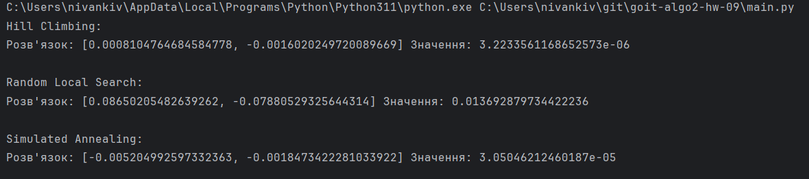

# goit-algo2-hw-09
# Results
  
# Висновок:
Всі розв'язки знаходяться в межах заданого діапазону [−5, 5], а отримані значення цільової функції є прийнятними для мінімізації функції Сфери. Це демонструє, що алгоритми працюють коректно. За точністю найкращий — Hill Climbing, Simulated Annealing трохи поступається, а Random Local Search є найменш точним.
